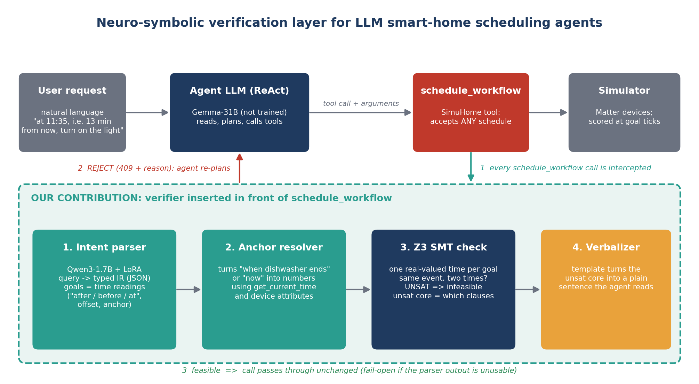
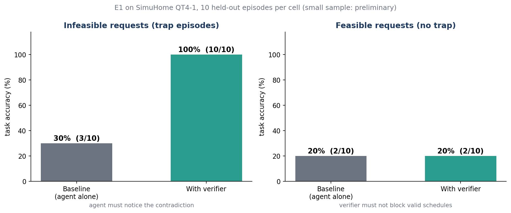

# Neuro-Symbolic Verification for LLM Smart-Home Scheduling Agents
### Project report for guide review: what I am doing, how it works, progress so far, next steps

> **Status (October 2026):** the full pipeline is built and works. First experiment (E1) on one scenario type gives a strong but *small-sample* result. More experiments are queued before writing the paper. Target: IEEE IoT Journal special issue, deadline **15 Dec 2026**.

---

## 0. One-minute summary (use this as your first slide)

- **Problem.** LLM agents that control a smart home fail badly on *scheduling* requests ("turn the light on 20 minutes after the dishwasher finishes"). The benchmark's own analysis shows the main failure is **contradiction blindness**: the request contains a timing contradiction, and the agent schedules it anyway, because the scheduling tool accepts anything.
- **Idea.** Put a small **logic checker in front of the scheduling tool**. A small fine-tuned language model converts the request into a structured form; a **Z3 SMT solver** proves whether the times can all hold at once; if not, the agent is told exactly why and can ask the user instead of scheduling nonsense.
- **We do not retrain the big agent.** It is a plug-in layer that works with any agent LLM.
- **Result so far (10 episodes per cell, one scenario type):** on contradictory ("infeasible") requests accuracy goes **30% → 100%**; on normal requests the checker blocked **nothing** (0 false rejections).
- **Honest limits:** small sample, one scenario type, templated queries. The next steps address exactly these.

---

## 1. Background: what is SimuHome and what is the problem?

**SimuHome** (ICLR 2026) is a simulated smart home built on the *Matter* standard (lights, washers, dishwashers, ACs, ...), plus a benchmark of 600 natural-language requests. An LLM agent runs a ReAct loop (think, call a tool, observe, repeat) using tools such as `get_current_time`, `get_room_devices`, `get_attribute`, `schedule_workflow`, `finish`.

The hardest category is **QT4 = scheduling** (do something later, after another device finishes, or at the same time as another device). It has three sub-types (QT4-1, QT4-2, QT4-3) and two cases:

| Case | Meaning | How it is scored |
|---|---|---|
| **Feasible** | the request can be done | simulator state is checked at the goal times, plus required lookups must have been made |
| **Infeasible** | the request contains a contradiction (a "trap") | an LLM judge checks that the agent reported the temporal conflict |

**The failure we target.** The paper's error analysis says that on infeasible requests most errors are *contradiction blindness*. Real example from the data:

> "Schedule light 1 in the kitchen to turn on at **7 PM, that is 25 minutes from now**..."

If the clock says it is 18:42, then "25 minutes from now" = 19:07, not 19:00. Both cannot be true. The scheduling tool returns "OK" anyway and the agent never finds out.

---

## 1b. Paper vs this project

| Aspect | SimuHome paper (ICLR 2026, arXiv 2509.24282) | This project |
|---|---|---|
| Type of work | Benchmark + simulator; evaluates 18 LLM agents (ReAct) | A **fix** for one failure the benchmark exposes |
| What it observes | QT4 is the hardest category. On infeasible QT4 the dominant error is **contradiction blindness** (Fig. 4d: 85%; Table 11: 40/44, 25/33, 30/34 for QT4-1/2/3). `schedule_workflow` only confirms registration, with no validation (Sec. 5.3) | Takes exactly this failure as the target |
| Fixes tried | HiAgent framework (mixed); **self-correction prompting** (recovery at most 18.5% on QT4-2, 0% on QT4-3, App. M); oracle failure notice (55-67% recovery, an upper bound, impractical); SFT of the *agent* on 204 GPT-5.1 trajectories (Gemma3-4B, Qwen3-32B: infeasible detection up to +26 points, QT4-3-F no gain) | A **pre-execution gate**: small trained parser + checker in front of the tool; the agent is not fine-tuned |
| Proposed future work | App. L: **simulation-based pre-validation**, using the simulator as a runtime world model, "going beyond simple API checkers" | A lightweight alternative at *request* level: checks whether the stated times are mutually consistent before anything is scheduled (does not simulate execution) |
| Training | None of its own method; SFT baseline on agent trajectories | LoRA fine-tune of Qwen3-1.7B on (query, IR) pairs generated automatically from the benchmark's own `eval.goals` / `temporal_conflict` (no manual labels) |
| Representation | Natural language + tool calls | Typed IR of time readings; Z3 constraints; unsat core |
| Feedback to the agent | "Registered OK" | `409 TEMPORAL_CONTRADICTION` plus the clashing statements in plain words |
| Scope and scale | 600 episodes, 12 categories, 18 models | QT4 only; QT4-1 run so far (10 held-out episodes per cell); one agent (Gemma-31B via NVIDIA free API) |
| Scoring | Simulator state (feasible), LLM judge (infeasible) | Same evaluators, so results are comparable in kind (not directly comparable in numbers: different agent and sample) |

**Reference numbers from the paper (Table 1, success %, read from the PDF text layer; confirm against the table before quoting):**

| Agent | QT4-1 F / IF | QT4-2 F / IF | QT4-3 F / IF |
|---|---|---|---|
| GPT-4.1 | 50 / 12 | 46 / 34 | 34 / 32 |
| GPT-5.1 (reasoning) | 60 / 100 | 72 / 92 | 56 / 44 |

Reasoning models take roughly 3-5x longer per episode (GPT-5.1 over 100 s on the hardest tasks, Table 2).

**What this means for positioning**

- Our QT4-1 infeasible result (30% -> 100%, Gemma-31B) is real but **not exceptional**: a frontier reasoning agent already reaches 100% on QT4-1-IF with no verifier. The case for the verifier is a cheap/fast non-reasoning agent, latency (a 1.7B parser + checker vs a 100 s reasoning model), and the harder sub-types, especially **QT4-3-IF, where even GPT-5.1 gets 44%**.
- The paper explicitly leaves pre-validation to future work and argues for a simulator-in-the-loop version. Reviewers will compare against that. Our framing: a cheap request-level consistency check, not an execution-outcome check.
- The paper's weak self-correction result (App. M) is about recovery *after* scheduling. Our `selfcheck` arm tests a *pre-scheduling* prompt check and still has to be run.
- Our weak feasible results (20%) match the paper's picture: feasible QT4 is dominated by device-control errors (40% of QT4-F errors) and temporal errors (25%), which a temporal verifier does not address.

---

## 2. The idea: a verifier in front of `schedule_workflow`



*(Figure: `docs/architecture.png`. Top row = what SimuHome already has. Green dashed box = what I built.)*

### What happens on one request, step by step

1. The user request goes to the **agent LLM** (we use Gemma-31B, *not trained by us*).
2. The agent calls `schedule_workflow` with a plan. **Our verifier intercepts that call.**
3. **Intent parser** (Qwen3-1.7B + LoRA, trained by us): reads the *original user query* and writes a small structured description (the **IR**, see section 3).
4. **Anchor resolver:** replaces things like "now" or "when the dishwasher ends" with numbers, using `get_current_time` and device attributes from the simulator.
5. **Z3 check:** each goal becomes one real-valued time variable; every way the user stated its time becomes a constraint. If two statements force different times, the solver says **UNSAT** (infeasible) and returns the **unsat core** = the minimal set of clashing statements.
6. **Verbalizer:** a template turns the core into a plain sentence. Real example from our run:
   `Infeasible schedule: Goal 0: stated clock time 19:00 vs. 25.0 min after now`
7. **Reject** (HTTP-style 409 `TEMPORAL_CONTRADICTION` + that sentence) so the agent can re-plan or tell the user. If the plan is **feasible**, the call passes through unchanged. If the parser output is unusable, the verifier **fails open** (does nothing), so it can never make things worse by crashing.

### Why this design (talking points for the guide)

- **Neural part does what it is good at** (understanding messy language) and **symbolic part does what it is good at** (guaranteed correct time arithmetic and a proof when something is impossible).
- **Small model + solver, no retraining of the large agent**, so it is cheap and model-agnostic (relevant for IoT: could run on an edge hub).
- **Explainable:** the agent and user see *which* statements clash, not just "failed".

---

## 3. The IR (intermediate representation)

The parser turns a sentence into this compact JSON. Think of it as "the schedule, with every stated time written down separately".

```
goals: [ { id, targets: [device + attributes wanted],
           time_readings: [ { relation: after | before | at,
                              anchor: now | device_event | none,
                              offset_minutes, absolute_clock, tolerance } ] } ]
```

- A **feasible** request has goals whose readings agree.
- An **infeasible** request has a goal with two readings that resolve to **different** times (like "7 PM" and "25 minutes from now").
- Z3 variable per goal: `t_goal` (real number of minutes). Each reading adds `t_goal == anchor + offset` (within a tolerance). Contradiction => UNSAT.

Design details I settled on: a *compact* IR (fewer tokens for the small model; the encoder fills defaults back in), tolerance of 1 minute when only HH:MM is given, and device-event anchors pinned by values read from the simulator.

---

## 4. What exists in code (all written and tested)

| Piece | File / location | Status |
|---|---|---|
| IR data classes, compact form | `src/ir_schema.py` | done |
| Z3 encoder + unsat core | `src/constraint_encoder.py` | done, **286/286 correct** on all feasible/infeasible episodes with the *ground-truth* IR (excludes 14 episodes that need a duration model) |
| Deterministic IR extraction from benchmark episodes | `src/extract_ir_from_episode.py` | done |
| Verbalizer | `FeasibilityResult.explanation()` in `src/constraint_encoder.py`, `verbalize_rejection` in the notebook | done |
| Training data builder (query, IR) pairs | notebook sec. 4 | done: 300 native episodes, split 221 train / 25 val / 54 test (held-out by seed) |
| Parser fine-tuning (Qwen3-1.7B, LoRA) | notebook sec. 5 | done |
| Verifier hook into SimuHome (patches `schedule_workflow`) | notebook sec. 6 | done, verified end to end with a mock server |
| Evaluation harness (3 arms, 6 cells) | notebook sec. 7 | done |
| One combined Kaggle notebook | `notebooks/00_full_pipeline.ipynb` | done (T4 GPU) |

Engineering lessons (could be one methods paragraph): the evaluator must run **in-process** because SimuHome uses multiprocessing workers that would not see our patches; the request layer needs throttling because the free API is rate-limited; the parser is pinned to GPU 0 of the Kaggle T4 pair (the second GPU is only used when a local agent model is served).

---

## 5. Results so far

### 5.1 Parser (Qwen3-1.7B + LoRA), on the 54 held-out episodes

| Metric | Result | Meaning |
|---|---|---|
| Valid JSON | **54 / 54** | the model never produced unparsable output |
| Verdict accuracy | **42 / 46 = 91%** | Z3, fed with the *predicted* IR, reaches the right feasible/infeasible answer |
| Exact IR match | 20 / 54 (37%) | stricter: every field identical. Less important than the verdict, since small differences between predicted and gold IR need not change the verdict |

### 5.2 End-to-end experiment E1 (QT4-1, 10 held-out episodes per cell, Gemma-31B agent)



| Case | Agent alone | Agent + verifier | Verifier activity |
|---|---|---|---|
| Infeasible | 3/10 = **30%** | 10/10 = **100%** | 14 calls rejected, 0 parse failures |
| Feasible | 2/10 = 20% | 2/10 = 20% | 28 calls passed, **0 rejected** (no harm) |

### 5.3 How to read these honestly

- **Strong signal on the target failure**, and the checker is **safe** on normal requests (0 false rejections in 28 checks).
- **Feasible accuracy is low (20%) for both arms.** I diagnosed why from the traces: the **timing is actually right** (e.g. "15 minutes from now" and "23 minutes after the previous action" were computed correctly), but the agent **invents device commands** (e.g. `SetFanSpeed` / `MoveToLevel` instead of the real attributes, or `temperature: 100`). Episodes where the agent never called `get_device_structure` mostly fail. This is a *device-command* weakness of the agent model, **not a scheduling-logic problem**, so it is outside what this verifier targets. It should be stated as a limitation, or addressed with a stronger agent model.
- **n = 10 per cell is small.** 3/10 vs 10/10 is suggestive, not statistically strong. More episodes are needed.
- Only **QT4-1** so far. QT4-2 and QT4-3 are not run yet.

---

## 6. What a reviewer will ask (and my plan)

| Likely criticism | Plan |
|---|---|
| "Is a Z3 check too simple to be novel?" | Add richer constraints: dependency chains, concurrency, device durations (the 14 skipped `completion_vs_pause` episodes need a duration model). Emphasise the *system*: small-LM parser + solver + explanation + agent-agnostic. |
| "Why not just ask the LLM to double-check?" | **Prompt-only self-check arm** (now implemented, see 7.2). Same agent told to check consistency, no Z3. |
| "Queries are templated; will the parser generalise?" | Test on human/LLM **paraphrased** queries; report accuracy drop. |
| "Only one agent model." | Add a second agent model (a cheap paid one is fine). |
| "n is too small." | 30+ episodes per cell, all six cells (QT4-1/2/3 x feasible/infeasible). |
| "Where does the parser fail?" | Error analysis of the 4 wrong verdicts out of 46. |

---

## 7. Next steps (ordered)

### 7.1 Done locally in this round
- Diagnosed the low feasible accuracy (section 5.3).
- **Added a third experiment arm (`selfcheck`)** to the notebook generator: the same agent plus a prompt telling it to check time consistency, no Z3. Notebook regenerated and syntax-checked; **not yet run on Kaggle**.
- **Extended E1 to all six cells** (QT4-1/2/3 x feasible/infeasible) and three arms.
- Wrote this report and the two figures (`docs/make_figures.py` regenerates them).

### 7.2 Next Kaggle session (about 1 hour per arm per cell with the free API, so run in pieces)
1. Upload `qwen3_ir_parser_adapter_v2` as a Kaggle dataset (skips retraining).
2. Upload the new `00_full_pipeline.ipynb`, run setup, simulator and verifier cells, then the E1 cell. Trim `E1_CELLS` per session; finished runs are skipped and results are saved after every run.
3. Priority order: QT4-1 infeasible with `selfcheck` arm, then QT4-2, then QT4-3.
4. Download the zip and bring it back for the results table.

### 7.3 Before writing the paper
- Increase episodes per cell (`E1_MAX_SEEDS`) to 30+ for the main cells.
- Paraphrase test set for the parser.
- Second agent LLM.
- Ablations: parser without Z3, oracle IR vs predicted IR, verbalizer template vs raw core, latency overhead of the check.
- Duration-aware constraints for the skipped episodes.
- Update `ARCHITECTURE.md` (partly stale) and write the paper.

### 7.4 Suggested timeline (to 15 Dec 2026)
| When | Goal |
|---|---|
| Oct (now) | self-check arm + all six cells with 10 seeds |
| Early Nov | scale to 30 seeds, second agent, paraphrase test |
| Mid Nov | ablations, error analysis, richer constraints |
| Late Nov | write paper, figures, tables |
| Early Dec | revise with guide, submit before 15 Dec |

---

## 8. Slide outline for your PPT (1 idea per slide)

1. **Title + one-line claim** (the one-minute summary).
2. **Motivation:** LLM agents in smart homes; scheduling is the hardest task (GPT-4.1 only 34-50% on QT4).
3. **The failure:** contradiction blindness, with the "7 PM = 25 minutes from now" example.
4. **Prior work vs ours:** the paper measures and suggests simulation-based pre-validation; we build a lightweight request-level gate (table in section 1b).
5. **Idea:** verifier between agent and tool (use `architecture.png`).
6. **How it works on one request** (the 7 numbered steps, as an animation).
7. **The IR + Z3 formulation** (small JSON example + "UNSAT => infeasible + unsat core").
8. **Parser training:** Qwen3-1.7B + LoRA, 221 / 25 / 54 split, 91% verdict accuracy.
9. **Experiment setup:** SimuHome QT4, held-out episodes, Gemma-31B agent, arms.
10. **Results chart** (`e1_results.png`) + 0 false rejections.
11. **Honest limitations** (n=10, one scenario, agent invents commands, templated queries).
12. **Next steps and timeline** (section 7).
13. **Contribution summary + target venue.**

**Speaker notes tip:** if asked "is it novel?", say: the contribution is the *system and evidence* (small neural parser + SMT proof + natural-language explanation, plug-in for any agent, evaluated on a standard benchmark), not Z3 itself; the richer constraints and baselines in section 6 make that case stronger.

---

## 9. Glossary

- **LLM agent / ReAct:** a language model that alternates reasoning and tool calls.
- **SMT / Z3:** a solver that decides whether a set of logical/arithmetic constraints can all be true. **UNSAT** = impossible; the **unsat core** is a minimal conflicting subset.
- **IR:** intermediate representation, here the structured JSON of the request.
- **LoRA:** a cheap way to fine-tune a large model by training small adapter matrices.
- **Held-out:** episodes the parser never saw in training (selected by seed).
- **Fail-open:** if the verifier cannot decide, it lets the call through.
- **Contradiction blindness:** the agent does not notice that the request contradicts itself.
- **Infeasible / feasible:** whether a request has a consistent solution.
- **Unsat core -> verbalizer:** turns the conflicting clauses into one readable sentence.

---

## 10. Where everything is

| What | Where |
|---|---|
| Combined Kaggle notebook | `neuro_symbolic_scheduler/notebooks/00_full_pipeline.ipynb` |
| Source code | `neuro_symbolic_scheduler/src/` |
| Tests (Z3 regression 286/286) | `neuro_symbolic_scheduler/tests/test_pipeline.py` |
| E1 raw results + traces | `e1_results/` (aggregates, telemetry, per-episode traces, parser adapter) |
| This report + figures | `neuro_symbolic_scheduler/docs/` |
